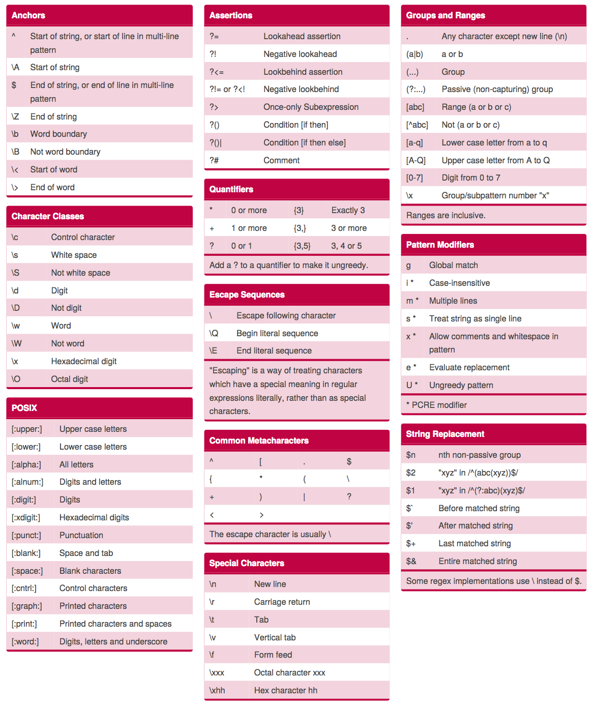

```{r setup, include=FALSE}
knitr::opts_chunk$set(echo = TRUE)

# need to set your own path
setwd("~/git/2017_cebu/")

# the package we will use in the workshop
.packages <- c("RCurl", "stringr", "tm", "SnowballC", "wordcloud", "ggplot2", "cluster", "fpc")

# install the package if it is not in the local R
.inst <- .packages %in% installed.packages()
if(length(.packages[!.inst]) > 0) {
  install.packages(.packages[!.inst], repos = "http://cran.rstudio.com")
}
lapply(.packages, library, character.only=TRUE)

# file paths of sample data
fpath <- "https://raw.githubusercontent.com/ckbjimmy/2017_cebu/master/data/id.txt"
download.file(url=fpath, destfile='id.txt', method='curl')
fpath <- "https://raw.githubusercontent.com/ckbjimmy/2017_cebu/master/data/idash.txt"
download.file(url=fpath, destfile='idash.txt', method='curl')
```


## Objectives

Participants may leave this workshop with skills to:

- Understand how to use basic **regular expression** syntax
- Able to apply regular expression to extract features
- Learn how to do preprocess textual raw data and transform into **bag-of-words / n-grams** representation for downstream analysis


## Instructions

**Before beginning**, please test to see if the Rmd file will compile on your system by clicking the "Knit HTML button" in R studio above. 


## Introduction of biomedical text mining

Much of data in the electronic health record (EHR) are not well structured. For example, the user-generated data, such as clinical notes, radiology reports, pathology reports, and the up-to-date scientific literature in PubMed, are usually semi-structured or unstructured natural language texts. To parse and extract useful (or specific) information from the semi-structured or unstructured data for further analysis and data modeling, text mining techniques are necessary.  

In this workshop, we will first learn how to use regular expression to do pattern matching in the free text. Next, we will utilize all the information in the text using bag-of-words and n-grams language models. Results of these techniques can be used for downstream applications, such as performing exploratory analysis or building machine learning models. We will use R language for the workshop.  


## Regular expression  

Regular expression is a method of pattern matching based on formal computational language, and is implemented in many languages. The specific syntax used in each language may vary, but the concepts are the same. Here we would use R to do regular expression for pattern matching. For the definition and background theory of regular expression, please refer to the introduction slides [(http://web.mit.edu/hackl/www/lab/turkshop/slides/regex-cheatsheet.pdf)](http://web.mit.edu/hackl/www/lab/turkshop/slides/regex-cheatsheet.pdf).  

(Courtesy by Dr. Matthieu Komorowsky) To visualize how regular expressions work, we will use the website: [https://regex101.com/](https://regex101.com/). Please paste the following text into the "Test String" search box:

```
LISINOpril 40 MG PO Daily
captopril 6.25 MG PO TID
lisinopril 40 mg PO Daily
LISINOPRIL
april
pril
labetalol
Propanolol 1PC STAT
April 5th
Lisinopril captopril
```

and try the following regex rules:

1. `pril`
2. `.*pril`
3. `[a-z]*pril`
4. `[A-Za-z]*pril`
5. `[A-Za-z]*pril ` (there is a space character after `pril`)

Observe results. What patterns in the text can you match using the above five rules? What if you want to match only (there are different answers but we provide only one for your reference):  

(1) four items with lisinopril (case insensitive)  
(2) two beta blockers (end with `-lol`)  

### Answer

(1) `(?i)lisinopril` (`(?i)` means case insensitive)  
(2) `[A-Za-z]*lol`

You may use the following cheetsheet to match the pattern that you want to try!  



**Figure: More regular expressions, courtesy by [Dave Child](https://www.cheatography.com/davechild/cheat-sheets/regular-expressions/pdf/)**


## Basic regular expression in R  

Now let's go to R. We first store our data into a vector `item`.  

```{r}
item <- c("LISINOpril 40 MG PO Daily", "lisinopril 40 mg PO Daily", "captopril 6.25 MG PO TID",
          "LISINOPRIL", "april", "pril", "labetalol", "Propanolol 1PC STAT", 
          "Today is April 5th", "Lisinopril captopril")
```


There are several functions in R related to regular expression.  

- `grep` function will give you the index of items in the vector based on your regex rule.  
- `grepl` function will return you `TRUE` or `FALSE` instead.  
- `regexpr` will answer where is the string the regex rule matches your item, and the length of matched string (`-1` means not matched).  
- `gregexpr` return you the exact same thing but in a list format.  

You may decide which function is useful in your pattern matching task based on the return value.  

```{r}
grep("pril", item, perl=TRUE)
grepl("pril", item, perl=TRUE)
regexpr("pril", item, perl=TRUE)
gregexpr("pril", item, perl=TRUE)
```

However, you may want to use `regexpr` and `regmatches` together to get matched strings rather than index or boolean value. We use `regexpr` to get the location of matching, and use `regmatches` to extract the matched strings.  

```{r}
re <- regexpr("[A-Za-z]*pril", item, perl=TRUE)
re
regmatches(item, re)
```

### Exercise  

What if you just want to match lower cases words end with `pril`?  

```{r}
re <- regexpr("TYPE_IN_YOUR_ANSWER", item, perl=TRUE)
regmatches(item, re)
```

### Answer  

`[a-z]*pril`  
  
  
Sometimes we want to replace specific strings while text cleaning. We can use  

- `sub` function to replace the first occurred matched string, or use  
- `gsub` to replace ALL matched strings.  

Here we try to replace the first / ALL `-pril` medication to `[DELETED]`.  

```{r}
sub("[A-Za-z]*pril", "[DELETED]", "Lisinopril captopril")
gsub("[A-Za-z]*pril", "[DELETED]", "Lisinopril captopril")
```

`gsub` function can also be used to extract the specific string. For example, the dosage of medication. The first argument of `gsub` function is is the matching pattern, and the second argument means that the specific pattern you want to extract. In this example, we want to extract the second pattern, the dosage (`\\2`), among the consecutive three specific patterns (`(SOMETHING)(EXTRACT_THE_PATTERN_INSIDE_THIS_PARENTHESIS)(SOMETHING)`):  

- Pattern 1. `[A-Za-z]* ` (zero - many alphabets, following a space character)  
- Pattern 2. `[0-9]+` (one - many digits)   
- Pattern 3. ` [MGmg].*` (MG or mg followed by a space character, and following any strings)  

```{r}
gsub("([A-Za-z]* )([0-9]+)( [MGmg].*)", "\\2", 
     c("lisinopril 40 MG PO Daily", "captopril 5 mg PO BID"))
```

### Exercise  

Identify/Extract following items from the short text `Indication: Endocarditis. Valvular heart disease.`  

1. Identify whether the short text includes the pattern `Indication: `  
2. Extract the string after `Indication: `  
3. Extract the first indication `Endocarditis`  
4. Extract the second indication `Valvular heart disease`  

### Answer

```{r}
text <- "Indication: Endocarditis. Valvular heart disease."

grepl("Indication: (.*)", text)
gsub("(Indication: )(.*)(.*)", "\\2", text)
gsub("(Indication: )([aA-zZ]+)(.*)", "\\2", text)
gsub("(Indication: [aA-zZ]+. )([aA-zZ ]+)(.*)", "\\2", text)
```

### Exercise  

We want to extract some variables from  

```
Indication: Endocarditis. Valvular heart disease.
Height: (in) 64
Weight (lb): 170
BSA (m2): 1.83 m2
BP (mm Hg): 92/61
```

For example, we can extract the weight (`170`) using the following regular expression:    

```{r}
text <- "
Indication: Endocarditis. Valvular heart disease.
Height: (in) 64
Weight (lb): 170
BSA (m2): 1.83 m2
BP (mm Hg): 92/61
"

grepl("Weight \\(lb\\): (.*?)\n", text)
gsub("(.*Weight \\(lb\\): )([0-9]+)(\n.*)", "\\2", text)
```

The double-backslash is [**escape character**](https://en.wikipedia.org/wiki/Escape_character) in R, which is necessary if your pattern has any punctuations because punctuations have different meanings in regular expression. For example, a dot (`.`) means "match all" in regular expression. Therefore, you need to use escape character (here the double-backslash) to force R recognize the punctuation as a character rather than the matching syntax. More details in the [stackoverflow post](https://stackoverflow.com/questions/27721008/how-do-i-deal-with-special-characters-like-in-my-regex).  

Now try to extract the following numbers:

1. the height (`64`)
2. systolic blood pressure (`92`)

```{r}
grepl("Height: \\(in\\) (.*?)\n", text)
gsub("(.*Height: \\(in\\) )([0-9]{2})(\n.*)", "\\2", text)
gsub("(.*BP \\(mm Hg\\): )([0-9]+)(/[0-9]+\n.*)", "\\2", text)
```

Now that we have a basic understanding of how regular expressions work, we will apply it to the sample note file. We'd like to load the real data into R environment. The data we used here is [**PhysioNet Deidentified Medical Text**](https://physionet.org/works/DeidentifiedMedicalText/) maintained by MIT Laboratory of Computational Physiology. The single file (`id.txt`) includes 2434 nursing records in free text format. In this chunk of codes, we used regular expression for splitting a huge single file into 2434 notes.  

```{r}
# read the file
data <- readChar("id.txt", file.info("id.txt")$size)
# replace "||||END_OF_RECORD [change line] START_OF_RECORD=number||||number||||" to "[split]"
data <- gsub("\n\n\\|\\|\\|\\|END_OF_RECORD\n\nSTART_OF_RECORD=[0-9]+\\|\\|\\|\\|[0-9]+\\|\\|\\|\\|\n", " [split] ", data)
# replace the last "||||END_OF_RECORD" to "" since it can't be replaced by the previous line
data <- gsub("\n\n\\|\\|\\|\\|END_OF_RECORD\n\n", "", data)
# split the data by identifying the string "[split]"
data <- strsplit(data, " \\[split\\] ")
data <- data[[1]]
```

If you are interested in this pattern matching process for data splitting, you may open the `id.txt` and see that the format of notes is:  

```
START_OF_RECORD=number||||number||||

...context...

||||END_OF_RECORD
```

We used the regular expression to replace all strings with the pattern of  `\n\n\\|\\|\\|\\|END_OF_RECORD\n\nSTART_OF_RECORD=[0-9]+\\|\\|\\|\\|[0-9]+\\|\\|\\|\\|\n` into `[split]`, and used the string `[split]` as an indicator to split the file.  

Let's see if we can extract the information of neurological examination from nursing notes. After quickly going through the raw data, we found that there are some patterns for neurological examination:  
```
Neuro: ...(the data we want)... .
NEURO: ...(the data we want)... .
Neuro= ...(the data we want)... .
Neuro- ...(the data we want)... .
```

These patterns are useful for extracting neurological exam data. We can first use `grepl` to identify the index of matched strings. Then we use `gsub` to extract targeted data. The bar (`|`) means OR operation. The result can be used as a feature for further analysis.  

```{r}
has_neuro <- grepl("(Neuro:|NEURO:|Neuro=|Neuro-)", data, perl=TRUE)
neuro <- gsub("(.*Neuro:|.*NEURO:|.*Neuro=|.*Neuro-)(.*?)(\\.$|\n.*)", "\\2", data[has_neuro])
# show the first six results
head(neuro)
```

### Exercise  

Can you extract the information about cardiovascular examination? 
p.s. matching patterns include `CV:`, `C/V:`, `CV=`, `CV-`, `cv:`

### Answer  

```{r}
has_cv <- grepl("(CV:|C/V:|CV=|CV-|cv:)", data, perl=TRUE)
cv <- gsub("(.*CV:|.*C/V:|.*CV=|.*CV-|.*cv:)(.*?)(\\.$|\n.*)", "\\2", data[has_cv])
head(cv)
```

(Optional) In addition, you may also try `str_replace_all` and `str_extract_all` functions in `stringr` package to replace or extract features you want by regular expressions.  

```{r}
library(stringr)
item
str_replace_all(item, ".*pril.*", "[DELETED]")
str_extract_all(item, "[0-9]+")
```


## Natural language processing - building language model

In the previous section, we used regular expressions for the pattern matching. Here we'd like to introduce some natural language processing (NLP) techniques to implement linguistic and terminological approaches for text mining. For example, word tokenization, word stemming, term frequency-inverse document frequency (tf-idf) weighting, and n-grams algorithm.  

There are some good libraries in R for NLP. We will use the packages `tm` (for text processing) and `SnowballC` (for word stemming) in this workshop. However, there are more powerful free open-source libraries such as [Natural Langauge Toolkit (NLTK)](http://www.nltk.org/) and [spaCy](https://spacy.io/) for NLP if you use Python.  

Here we downloaded publicly available 431 clinical notes and reports from [iDASH Clinical Notes and Reports Repository](https://idash-data.ucsd.edu/community/45/) for building language models. The dataset was further annotated with the suitable document theme by two clinicians (Weng, 2017).  

```{r}
# read data (text + label)
idash <- read.table("idash.txt", sep = "\t", header = FALSE, comment.char="", stringsAsFactors = FALSE)
# put texts in the variable "data" -> this will be the material for building model
data <- idash$V1
# put labels in the variable "label" -> this will be the ground truth of machine learning
label <- as.factor(idash$V2)
```

Before modeling, data preprocessing and cleaning are necessary to reduce noises and useless information. We usually perform the following steps for **lexical normalization**:  

1. convert to lower cases
2. remove punctuation
3. remove numbers
4. remove white space
5. remove stopwords (very common and non-specific words such as a, the, is, ...)
6. perform word stemming (e.g. computers, computer, computing, compute -> comput)
7. tokenize the corpus into words

```{r}
library(tm)
library(SnowballC)

# transform into the format that tm can process
corpus <- Corpus(VectorSource(data))
corpus <- tm_map(corpus, tolower)
# remove all metadata that we don't need
corpus <- tm_map(corpus, PlainTextDocument) 
corpus <- tm_map(corpus, removePunctuation)
corpus <- tm_map(corpus, removeNumbers)
corpus <- tm_map(corpus, stripWhitespace)
# remove stopwords
# you can also add other words that you want to remove, for example, "apple"
corpus <- tm_map(corpus, removeWords, c(stopwords("english"), "apple"))
# remember to import "SnowballC" library before stemming
corpus <- tm_map(corpus, stemDocument)
```

(Optional) We don't need POS tagging or NER to identify names, locations, organizations, etc. since medical texts usually needs to be deidentified before analysis. However, please check [this webpage](https://rpubs.com/lmullen/nlp-chapter) if you are interested in performing POS tagging and NER in R. Please also check [this stackoverflow](https://stackoverflow.com/questions/30738974/rjava-load-error-in-rstudio-r-after-upgrading-to-osx-yosemite) if you want to import `openNLP` package for POS tagging and NER, but meet the `rJava` error while using Mac OSX Yosemite.  

After lexical normalization, the next step will be generating a **document-term matrix** for further analyses and machine learning tasks. This is a relatively computationally intensive task and it will occupy tons of memory (especially using R!) if you don't use the sparse matrix. Thankfully, `tm` package provides a function `DocumentTermMatrix` (or `TermDocumentMatrix`, if you need the reverse one) to generate the document-term matrix using sparse matrix.  

The default of `DocumentTermMatrix` is using bag-of-words and term frequency, which mean that each column of the matrix will be an unique word token, and the value will be frequenct of the word. While generating the document-term matrix, you may also ask R to perform [tf-idf weighting](https://nlp.stanford.edu/IR-book/html/htmledition/tf-idf-weighting-1.html), which may weight the words by their importance in the dataset (the value will no longer be the term frequency), or to apply [N-gram algorithm](https://en.wikipedia.org/wiki/N-gram) for preserving some semantics (the column will be a phrase instead of a word). For example, in the bag-of-words model, "I like dogs" will be tokenized into "I", "like", "dogs". Yet in the bigram model (n-gram, n=2), the sentence will be tokenized into "I like", "like dogs".  

In the following section, you can see the difference between  

(1) default bag-of-words,  
(2) tf-idf,  
(3) bigram (n-gram, n=2), and  
(4) unigram (bag-of-words) + bigram (n-gram, n=1 or 2) approaches.  

```{r}
# generate the default document-term matrix with bag-of-words and term frequency
dtm <- DocumentTermMatrix(corpus)
# document-term matrix is a sparse matrix
dtm
# show the most frequent words
findFreqTerms(dtm, lowfreq=300)

# generate the document-term matrix with bag-of-words and tf-idf weighting
dtm_tfidf <- DocumentTermMatrix(corpus,
                          control=list(weighting=function(x) weightTfIdf(x, normalize=TRUE),
                                        stopwords=TRUE))
dtm_tfidf
# show the most "important" words
findFreqTerms(dtm_tfidf, lowfreq=2.5)

# generate the document-term matrix with bigram and term frequency
BigramTokenizer <- function(x) 
  unlist(lapply(ngrams(words(x), 2), paste, collapse = " "), use.names = FALSE)
dtm_bigram <- DocumentTermMatrix(corpus, control = list(tokenize = BigramTokenizer))
dtm_bigram
findFreqTerms(dtm_bigram, lowfreq=100)

# generate the document-term matrix with bag-of-words + bigram and term frequency
UniBigramTokenizer <- function(x) 
  unlist(lapply(ngrams(words(x), 1:2), paste, collapse = " "), use.names = FALSE)
dtm_unibigram <- DocumentTermMatrix(corpus, control = list(tokenize = UniBigramTokenizer))
dtm_unibigram
findFreqTerms(dtm_unibigram, lowfreq=300)
```

We may also remove some less frequent words from the document-term matrix using `removeSparseTerms` function (here we preserve 99.5% of words). You may see that the sparsity decreases from 98% to 96%.  

```{r}
dtm <- removeSparseTerms(dtm, 0.995)
dtm
```


## Exploration and Visualization

Once we have generated the document-term matrix, we can use it for all kinds of analyses -- from exploratory analysis, clutering to statistical modeling. For example, we can use `findAssocs` to find words that have correlation > 0.05 with the word "ventricular".  

```{r}
findAssocs(dtm, "ventricular", corlimit=0.5)
```

We may also use `wordcloud` package to generate word cloud, or use `ggplot2` to create a frequency count barplot. For word cloud, you need to convert the sparse document-term matrix to a data matrix as an input. You may tune parameters and see what will change.   

```{r}
library(wordcloud)
# convert a sparse matrix into a data frame
df <- suppressWarnings(data.frame(as.matrix(dtm)))
# create a word cloud
wordcloud(colnames(df), colSums(df), scale=c(5, 1), max.words=50, min.freq=10, 
          color=brewer.pal(6, "Dark2"), vfont=c("sans serif", "plain"))

library(ggplot2)
# extract and sort the word-frequency pairs
freq <- sort(colSums(as.matrix(dtm)), decreasing=TRUE)
# convert the word-frequency pairs into a data frame for plotting
wf <- data.frame(word=names(freq), freq=freq)
# create a plot
p <- ggplot(subset(wf, freq > 300), aes(word, freq)) 
p <- p + geom_bar(stat="identity")
p <- p + theme(axis.text.x=element_text(angle=45, hjust=1))
p
```


## Clustering

The document-term matrix can also be an input of different machine learning algorithms. For example, the unsupervised learning algorithm, k-means clustering. We assumed that there are only two clusters in the data and performed k-means clustering (there are six clusters according to the ground truth). It will take few minutes to run the clustering and plotting. Feel free to set the cluster number to 6, but it will take longer time.   

```{r}
library(cluster)
library(fpc)

d <- dist(t(dtm), method="euclidian")
km <- kmeans(d, 2)
clusplot(as.matrix(d), km$cluster, color=T, shade=T, labels=2, lines=0)
```

However, the plot shows that the performance of clustering is not that good. We will use other language modeling techniques to make it better in the next workshop.  

### Exercise

Now we try to work on the [**PhysioNet Deidentified Medical Text**](https://physionet.org/works/DeidentifiedMedicalText/).  

```{r}
x <- readChar("id.txt", file.info("id.txt")$size)
x <- gsub("\n\n\\|\\|\\|\\|END_OF_RECORD\n\nSTART_OF_RECORD=[0-9]+\\|\\|\\|\\|[0-9]+\\|\\|\\|\\|\n", " [split] ", x)
x <- gsub("\n\n\\|\\|\\|\\|END_OF_RECORD\n\n", "", x)
x <- strsplit(x, " \\[split\\] ")
x <- x[[1]]
```

Please use this dataset to create an n-grams model with unigram + bigram + trigram, find  

1. How many terms/phrases has frequency >= 200?  
2. How many terms/phrases has correlation > 0.6 with the term "ventricular"?  

### Answer

```{r}
library(tm)
library(SnowballC)
corpus <- Corpus(VectorSource(x))
corpus <- tm_map(corpus, tolower)
corpus <- tm_map(corpus, PlainTextDocument)
corpus <- tm_map(corpus, removePunctuation)
corpus <- tm_map(corpus, removeNumbers)
corpus <- tm_map(corpus, stripWhitespace)
corpus <- tm_map(corpus, removeWords, c(stopwords("english"), "apple"))
corpus <- tm_map(corpus, stemDocument)
tok <- function(x) 
  unlist(lapply(ngrams(words(x), 1:3), paste, collapse = " "), use.names = FALSE)
dtm <- DocumentTermMatrix(corpus, control = list(tokenize = tok))
length(findFreqTerms(dtm, lowfreq = 200))
findAssocs(dtm, "ventricular", corlimit = 0.6)
```


## Conclusion

Thank you for chekcing out this workshop. We hope that you have some ideas of using regular expression and basic NLP techniques to process textual data in R. The next workshop will focus more on machine learning techniques for natural language modeling.  
